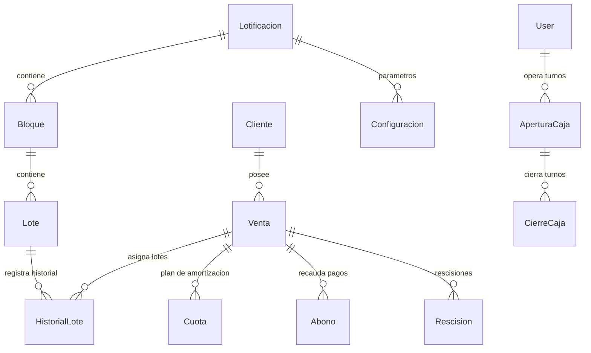

# 🏡 Sistema AMSA - ERP Inmobiliario & Gestión de Lotificaciones (Proyecto San Miguel)

> **Documento Maestro de Arquitectura, Estado y Guía para Desarrolladores**  
> *Última actualización: Septiembre 2026 | Rama de Producción: `Production`*

---

## 📌 1. Visión General del Proyecto
**AMSA System** (Proyecto San Miguel) es una plataforma integral **ERP/CRM Inmobiliaria** orientada a la administración de proyectos de urbanización, lotificaciones y ventas de bienes raíces a crédito y contado.

El sistema administra el ciclo de vida completo de la empresa:
1. **Inventario Físico:** Lotificaciones, bloques y lotes con áreas en metros cuadrados ($m^2$) y varas cuadradas ($vrs^2$).
2. **Cartera de Clientes & Contratos:** Expedientes de clientes, contratos de compraventa (unilote y multilote) con planes de amortización.
3. **Gestión Financiera & Recaudación:** Cobro de cuotas, anticipos, abonos extraordinarios, control de mora, conversión de montos a letras y emisión de recibos oficiales en PDF.
4. **Caja Diaria & Contabilidad:** Apertura/cierre de turnos de caja, conciliación bancaria (Efectivo vs Transferencias) y reportes de rendición con marcas de agua de seguridad.
5. **Portal Público para Clientes:** Consulta en línea de estados de cuenta vía enlaces seguros con token único.
6. **Panel de Parámetros del Sistema:** Configuración dinámica de políticas (mora, habilitación de módulos sensibles como traspasos, etc.).

---

## 🛠️ 2. Stack Tecnológico

| Componente | Tecnología / Librería | Versión / Detalle |
| :--- | :--- | :--- |
| **Backend Framework** | Laravel | PHP 8.x / Laravel 9/10 |
| **Base de Datos** | MySQL / MariaDB | Motor InnoDB, UTF8mb4 |
| **Frontend & UI** | Blade Templates + CSS/JS Vanilla + Vite | Diseño responsivo, modalización y layout unificado |
| **Control de Acceso** | `spatie/laravel-permission` | Roles: `admin`, `usuario`, `cajero`, etc. |
| **Generación de PDFs** | `barryvdh/laravel-dompdf` | Recibos térmicos/carta, reportes diarios y contratos |
| **Importación / Exportación**| `maatwebsite/excel` | Plantillas masivas de inventario y clientes |
| **Infraestructura / Hosting** | BanaHosting (cPanel / Apache / FastCGI) | Deploy automatizado vía GitHub Actions |

---

## 🏛️ 3. Arquitectura del Sistema y Modelado de Datos



### 3.1 Multi-Lotificación (Multi-Tenancy)
- El sistema cuenta con aislamiento por proyecto mediante el trait `\App\Traits\ScopedByLotificacion`.
- La sesión activa del usuario determina el contexto (`session('lotificacion_id')`).
- Consultas administrativas globales utilizan `withoutGlobalScopes()` o `withoutGlobalScope('lotificacion')`.

### 3.2 Modelos Principales (`app/Models/`)
- **`Lotificacion`**: Proyectos urbanísticos (ej. *Lotificación La Campana*, *Colinas Santa Clara*).
- **`Bloque`**: Manzanas o secciones de la lotificación (ej. *Bloque A*, *Bloque U*, *Bloque Ñ*).
- **`Lote`**: Unidad individual con `numero_lote`, `area_metros`, `precio_base` y `estado` (`Disponible`, `Vendido`, `Reservado`).
- **`Cliente`**: Datos del comprador (`expediente_num`, `identificacion`, `nombres_apellidos`, `telefono`, `token_publico`).
- **`Venta`**: Contrato de venta. Soporta ventas de 1 solo lote o múltiples lotes a través de la tabla pivote `historial_lotes`.
- **`Cuota`**: Plan de amortización generado dinámicamente (`numero_cuota`, `fecha_vencimiento`, `monto_total`, `capital`, `interes`, `saldo_restante`, `estado`).
- **`Abono`**: Transacciones de pago (`numero_recibo`, `codigo_recibo`, `monto_abonado`, `tipo_pago`, `metodo_pago`, `cuenta_destino`, `fecha_transferencia`, `recibo_firmado`).
- **`HistorialLote`**: Historial de vinculación entre ventas y lotes (`estado`: `Activo`, `Rescindido`, `Liberado`).
- **`Reserva`**: Reservas temporales previas a formalizar contrato.
- **`Rescision`**: Historial de rescisiones con cálculo de saldo devuelto, penalidad y liberación de lotes.
- **`AperturaCaja` / `CierreCaja`**: Control de caja por turno y fecha.
- **`Configuracion`**: Tabla de parámetros clave/valor por proyecto (`configuraciones`).
- **`Auditoria`**: Bitácora de eventos relevantes.

---

## 💡 4. Lógica de Negocio Crítica

### A. Cálculo y Sincronización de Cuotas
- Toda modificación en ventas, abonos o rescisiones **debe** sincronizarse invocando:
  ```php
  \App\Http\Controllers\AbonoController::recalcularCuotas($id_venta);
  ```
- Este método recalcula el saldo restante, amortiza de manera cronológica los abonos aplicados, determina el estado (`Pagada`, `Parcial`, `Pendiente`, `Mora`) y mantiene la coherencia matemática del estado de cuenta.

### B. Emisión de Recibos y Conversión a Letras
- Los recibos se generan en PDF con formato estándar y térmico.
- El monto se convierte automáticamente a texto en español mediante el helper `numeroALetras($monto)` en `AbonoController.php`.

### C. Módulo de Parámetros del Sistema (`/configuracion/parametros`)
- Permite a los administradores activar o desactivar opciones operativas sin tocar código.
- Ejemplo: La opción **"Traspasar Contrato"** (`mostrar_traspasar_contrato`) viene **oculta por defecto** para evitar errores operativos no autorizados y se activa desde este módulo.

---

## 🚀 5. Flujo de Despliegue y Mantenimiento en Producción

### 5.1 CI/CD (GitHub Actions)
- **Repositorio:** `https://github.com/LeonardoNtG/Proyecto-San-Miguel`
- **Rama Productiva:** `Production`
- **Flujo:** Al hacer `git push origin Production`, GitHub Actions ejecuta el despliegue automático por FTP al servidor BanaHosting (`/home/xyupoprg/public_html/AMSAsystem`).

### 5.2 Script de Diagnóstico en Producción (`limpiar.php`)
- **Acceso:** `https://proyectosanmiguel.com/AMSAsystem/limpiar.php`
- **Funcionalidades:**
  - Limpia caché de Blade y de configuración de Laravel.
  - Ejecuta migraciones pendientes de base de datos (`php artisan migrate --force`).
  - Audita el inventario completo de lotes por bloque y proyecto.
  - Permite recálculos bajo demanda (`?recalcular_todo=1`).
  - Muestra los últimos logs de error de `storage/logs/laravel.log`.

> ⚠️ **Nota:** Cualquier modificación a `limpiar.php` debe replicarse de forma idéntica en `public/limpiar.php` para mantener sincronizada la raíz y la carpeta pública.

---

## 💻 6. Guía Rápida para el Nuevo Desarrollador

### 6.1 Instalación Local
1. Clonar el repositorio:
   ```bash
   git clone -b Production https://github.com/LeonardoNtG/Proyecto-San-Miguel.git
   cd Proyecto-San-Miguel
   ```
2. Instalar dependencias de PHP y JavaScript:
   ```bash
   composer install
   npm install
   ```
3. Configurar el archivo `.env`:
   ```bash
   cp .env.example .env
   php artisan key:generate
   ```
4. Ejecutar migraciones y seeders:
   ```bash
   php artisan migrate
   ```
5. Iniciar el servidor local:
   ```bash
   php artisan serve
   npm run dev
   ```

### 6.2 Rutas y Controladores Clave

| Módulo | Controlador | Vistas |
| :--- | :--- | :--- |
| **Clientes** | `ClienteController` | `resources/views/clientes/` |
| **Ventas / Contratos** | `VentaController` | `resources/views/ventas/` |
| **Abonos / Recibos** | `AbonoController` | `resources/views/abonos/` |
| **Inventario (Lotes)** | `LoteController`, `BloqueController` | `resources/views/lotes/`, `bloques/` |
| **Caja y Reportes** | `ReporteController` | `resources/views/reportes/` |
| **Configuración** | `ConfiguracionController` | `resources/views/configuracion/` |
| **Portal Cliente** | `PortalClienteController` | `resources/views/portal/` |

---

## 📊 7. Estado Actual de Inventarios y Proyectos Verificados

- **Lotificación La Campana:** **608 Lotes en Total** distribuidos en 24 bloques (del Bloque A al Bloque Y).
  - *Bloque U:* 24 Lotes (`U-01` al `U-24`), lote `U-01` con $208.54\,m^2$ ($295.80\,vrs^2$).
- **Lotificación Colinas Santa Clara:** **385 Lotes en Total**.
